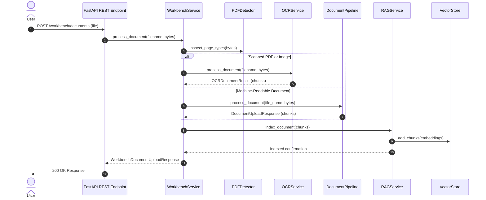
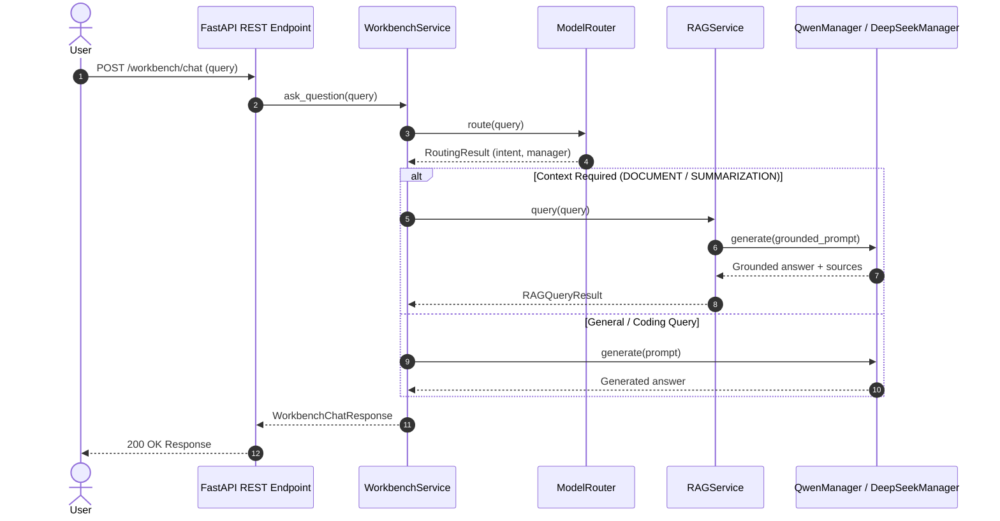
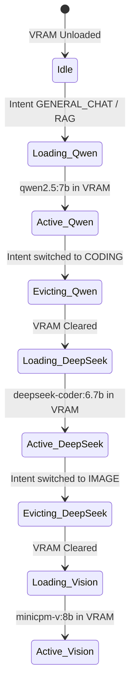
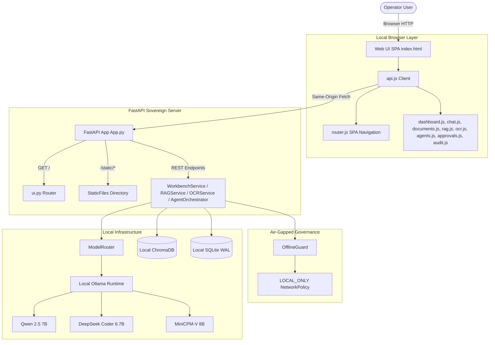

# Enterprise Architecture Specification

> **Sovereign On-Premise Agentic AI Workbench**  
> Technical Architecture Blueprint & Design Principles

---

## 1. Clean Architecture & Separation of Concerns

The architecture strictly adheres to **Clean Architecture** principles, maintaining clear dependency boundaries across system layers.

```
+-----------------------------------------------------------------------+
|                         Presentation Layer                            |
|                 (FastAPI REST API / Workbench API)                    |
+-----------------------------------+-----------------------------------+
                                    |
                                    v
+-----------------------------------------------------------------------+
|                    Unified Orchestration Service                      |
|            (src/services/workbench_service.py: WorkbenchService)     |
+-----------------------------------+-----------------------------------+
                                    |
                                    v
+-----------------------------------------------------------------------+
|                 OCR, Vision & Document Processing Subsystems          |
|      (src/ocr: PDFDetector, TextOCR | src/document_processing)       |
+-----------------------------------+-----------------------------------+
                                    |
                                    v
+-----------------------------------------------------------------------+
|                         Local RAG Subsystem                           |
| (src/rag: Embeddings | VectorStore | Indexer | Retriever | RAGService)  |
+-----------------------------------+-----------------------------------+
                                    |
                                    v
+-----------------------------------------------------------------------+
|                    Persistence & Crash Recovery Layer                  |
| (src/persistence: DatabaseManager, TaskRepo, ExecRepo, AuditRepo)    |
| (src/agents: TaskStateMachine, RecoveryManager, SQLiteStateStore)     |
+-----------------------------------+-----------------------------------+
                                    |
                                    v
+-----------------------------------------------------------------------+
|                          Routing Layer                                |
|    (src/routing: BaseRouter | IntentClassifier | ModelRouter)         |
+-----------------------------------+-----------------------------------+
                                    |
                                    v
+-----------------------------------------------------------------------+
|                    Domain Abstraction Layer                           |
|       (src/models: BaseModel Interface | src/schemas: Pydantic DTOs)    |
+-----------------------------------+-----------------------------------+
                                    |
                                    v
+-----------------------------------------------------------------------+
|                     Inference Adapter Layer                           |
|     (Ollama Adapter / vLLM Adapter / llama.cpp / LM Studio Adapter)   |
+-----------------------------------+-----------------------------------+
                                    |
                                    v
+-----------------------------------------------------------------------+
|                         Hardware & Models                             |
|       (Local Models: qwen2.5:7b, deepseek-coder:6.7b, minicpm-v:8b)   |
+-----------------------------------+-----------------------------------+
```

---

## 2. End-to-End Architectural Workflows

### Unified Document Ingestion Flow



### Grounded RAG Chat & Intent Routing Flow



---

## 3. Hardware Resource & Memory Management Lifecycle

The workstation hardware configuration (16 GB system RAM, NVIDIA RTX 5050 GPU ~8 GB VRAM) enforces a strict **Single-Model Memory Strategy**:



---

## 4. Complete REST API Endpoint Registry

| HTTP Method | Path | Subsystem / Workflow | Response Schema |
| :--- | :--- | :--- | :--- |
| **GET** | `/health` | System Health | `StandardResponse[Dict]` |
| **GET** | `/models` | Local Model Catalog | `StandardResponse[Dict]` |
| **GET** | `/router` | Model Router Telemetry | `StandardResponse[Dict]` |
| **POST** | `/chat` | Intent-based Chat Routing | `StandardResponse[ChatResponse]` |
| **POST** | `/documents/upload` | Document Parsing | `StandardResponse[DocumentUploadResponse]` |
| **POST** | `/documents/index` | RAG Chunk Indexing | `StandardResponse[RAGIndexResponse]` |
| **POST** | `/documents/query` | Grounded RAG Query | `StandardResponse[RAGQueryResponse]` |
| **DELETE** | `/documents/{id}` | Vector Chunk Eviction | `StandardResponse[Dict]` |
| **GET** | `/documents/rag/health` | RAG Telemetry | `StandardResponse[RAGHealthResponse]` |
| **POST** | `/ocr/process` | OCR & Page Analysis | `StandardResponse[OCRProcessResponse]` |
| **GET** | `/ocr/health` | OCR Telemetry | `StandardResponse[OCRHealthResponse]` |
| **POST** | `/workbench/chat` | Unified Grounded Chat | `StandardResponse[WorkbenchChatResponse]` |
| **POST** | `/workbench/documents` | Unified Ingestion | `StandardResponse[WorkbenchDocumentUploadResponse]` |
| **POST** | `/workbench/images` | Unified Vision Analysis | `StandardResponse[WorkbenchImageResponse]` |
| **GET** | `/workbench/health` | Unified Telemetry | `StandardResponse[WorkbenchHealthResponse]` |
| **POST** | `/agent/run` | Create & Execute Agent Task | `StandardResponse[AgentRunResponse]` |
| **POST** | `/agent/approve/{id}` | Approve Waiting Task | `StandardResponse[AgentApprovalResponse]` |
| **POST** | `/agent/reject/{id}` | Reject Waiting Task | `StandardResponse[AgentRejectionResponse]` |
| **GET** | `/agent/status/{id}` | Get Task Execution Status | `StandardResponse[AgentStatusResponse]` |
| **GET** | `/agent/plan/{id}` | Get Operational Plan | `StandardResponse[AgentPlanResponse]` |
| **POST** | `/agent/cancel/{id}` | Cancel Task Execution | `StandardResponse[AgentStatusResponse]` |
| **GET** | `/agent/tools` | List Registered Agent Tools | `StandardResponse[List[AgentToolSchema]]` |
| **GET** | `/agent/health` | Agent Subsystem Health | `StandardResponse[AgentHealthResponse]` |
| **POST** | `/auth/login` | Bearer Token Authentication | `StandardResponse[TokenResponse]` |
| **GET** | `/auth/me` | Active Identity Profile | `StandardResponse[UserResponse]` |
| **POST** | `/auth/logout` | Token Session Revocation | `StandardResponse[Dict]` |
| **GET** | `/operator/dashboard` | Server-Rendered Dashboard | `HTMLResponse` |
| **GET** | `/operator/system` | Operator Platform Telemetry | `StandardResponse[OperatorSystemResponse]` |
| **GET** | `/operator/models` | Model Catalog Status | `StandardResponse[OperatorModelResponse]` |
| **GET** | `/operator/memory` | RAM & VRAM Diagnostics | `StandardResponse[OperatorMemoryResponse]` |
| **GET** | `/operator/tasks` | Active Task Summaries | `StandardResponse[List[OperatorTaskResponse]]` |
| **GET** | `/operator/audit` | Structured Audit Event Log | `StandardResponse[List[AuditEventResponse]]` |
| **GET** | `/metrics` | In-Process Telemetry Map | `StandardResponse[MetricsResponse]` |
| **GET** | `/security/status` | Security Posture Summary | `StandardResponse[SecurityStatusResponse]` |
| **GET** | `/security/policy` | Tool Boundary & Policy | `StandardResponse[SecurityPolicyResponse]` |
| **GET** | `/security/events` | Recorded Security Violations | `StandardResponse[List[SecurityEventResponse]]` |
| **GET** | `/live` | Process Liveness Probe | `StandardResponse[Dict]` |
| **GET** | `/` | Web UI Operator Console Shell | `FileResponse (index.html)` |
| **GET** | `/static/*` | Local Static Assets (CSS, JS, SVG) | `StaticFiles` |
| **GET** | `/documents` | Indexed Document Metadata Catalog | `StandardResponse[List]` |
| **GET** | `/security/offline` | Air-Gapped Posture Status | `StandardResponse[OfflineStatusResponse]` |
| **POST** | `/security/offline/validate` | Air-Gapped Posture Validation Check | `StandardResponse[OfflineValidationResponse]` |

---

## 5. Offline-First Sovereign Design

- **Zero External Egress**: Engineered to run in 100% air-gapped industrial environments.
- **Local Weight Storage**: All open-weight LLMs (`qwen2.5:7b`, `deepseek-coder:6.7b`, `minicpm-v:8b`) execute locally on host workstation GPU hardware.
- **Data Sovereignty**: Industrial telemetry, schematics, and confidential documents remain exclusively on-premise.

---

## 6. Phase 14 Web UI Operator Console Architecture


