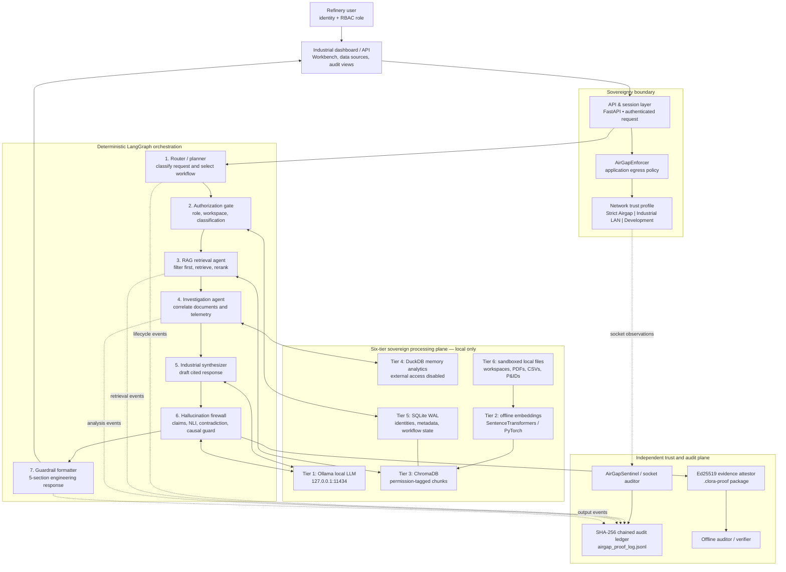
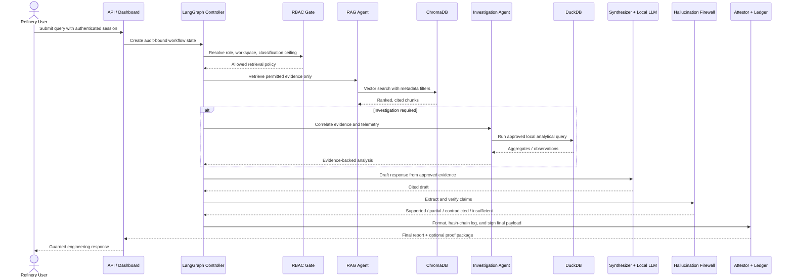

# Architecture & Multi-Agent Topology

## Purpose

The project is an on-premises, air-gap-capable AI workbench for refinery and critical operational-technology environments. Its architecture is designed around three non-negotiables:

1. **Data sovereignty** — documents, telemetry, models, and state remain inside the approved local environment.
2. **Least-privilege analysis** — user role and document classification constrain retrieval before any content reaches an AI model.
3. **Defensible outputs** — each engineering conclusion is evidence-checked, audit-logged, and optionally signed for offline verification.

> Note: the supplied README contains unresolved merge-conflict markers in its opening executive summary. This design uses the consistent technical requirements described in the rest of the document.

---

## Architecture at a glance



### Trust boundaries

| Boundary | What crosses it | Mandatory control |
|---|---|---|
| User → application | identity, role, request | authentication, workspace authorization, RBAC context |
| Application → agent graph | normalized request and approved context | deterministic workflow selection and audit event |
| Agent graph → knowledge stores | approved retrieval/analytics request | classification and role filter before vector results are returned |
| Agent graph → model | prompt plus only permitted evidence | local endpoint only; no remote model calls |
| Output → auditor | final report and proof package | canonical payload, SHA-256 fingerprint, Ed25519 signature |
| Process → network | any attempted socket connection | trust profile enforcement and tamper-evident logging |

---

## Multi-agent topology

The agents are a **controlled pipeline**, not an unconstrained group chat. The router selects the workflow, and all substantive branches converge at the verification gate before a response can be released.

```mermaid
flowchart LR
    Q["User query\n+ identity + role + workspace"] --> P["Planner / Router"]
    P -->|SOP or document question| R["RAG Agent"]
    P -->|telemetry or multi-source question| I["Investigation Agent"]
    P -->|mixed investigation| R
    R -->|permission-filtered evidence| I
    I -->|correlated evidence + observations| S["Industrial Synthesizer"]
    R -->|direct retrieval evidence| S
    S -->|draft with citations| C["Claim Extractor"]
    C --> N["Evidence Verifier & NLI Scorer"]
    N --> D{"Verdict"}
    D -->|supported| G["Causal Leap Guard"]
    D -->|partially supported| G
    D -->|contradicted / insufficient| E["Escalation & uncertainty record"]
    E --> G
    G --> F["5-section Guardrail Formatter"]
    F --> A["Ed25519 Attestation"]
    A --> O["Dashboard / API response\n+ .clora-proof export"]

    R -. "retrieval audit" .-> L["SHA-256 audit ledger"]
    I -. "analysis audit" .-> L
    S -. "generation audit" .-> L
    N -. "verification audit" .-> L
    A -. "attestation audit" .-> L
```



### Agent contracts

| Stage | Responsibility | Inputs | Outputs | Hard stop / safeguard |
|---|---|---|---|---|
| Planner / Router | Select a deterministic workflow | intent, role, workspace | route and task plan | no direct access to raw content |
| Authorization Gate | Build the allowed evidence scope | role, classifications, workspace | retrieval policy | deny or narrow unauthorized scope |
| RAG Agent | Retrieve cited, role-permitted material | query, policy | ranked evidence chunks | metadata filter is applied **before** similarity results enter context |
| Investigation Agent | Join evidence with local telemetry and calculations | evidence, approved DuckDB query | observations and correlations | external DuckDB access disabled; correlation is not causation |
| Industrial Synthesizer | Produce a concise engineering draft | approved evidence, observations | cited claims | no claim may rely on uncited context |
| Hallucination Firewall | Validate individual claims and causal language | draft, evidence | support status and confidence | contradictions and missing proof cannot be silently promoted |
| Guardrail Formatter | Create an operator-safe final structure | checked claims | findings, analysis, uncertainty, confidence, evidence | forces uncertainty disclosure |
| Evidence Attestor | Make final output independently verifiable | canonical final payload | signed `.clora-proof` | private key stays local |

---

## Core execution sequence



---

## Governance decisions

- **One source of truth for authorization:** RBAC and classification checks occur at retrieval time, not merely in the prompt. This prevents unauthorized chunks from ever reaching the LLM context.
- **Evidence flows forward; authority does not:** downstream agents consume evidence and structured results, but they cannot bypass the authorization or retrieval gates.
- **Verification is a release gate:** a synthesized answer is a draft until the claim verifier and causal-leap guard complete.
- **Audit and provenance are distinct:** the hash chain proves the integrity of execution history; Ed25519 signatures prove the integrity and origin of the exported final payload.
- **Network protection is defense in depth:** the application-level socket guard is valuable telemetry and enforcement, but production OT deployment should pair it with host firewall rules, network segmentation, and physical/industrial air-gap controls.

## Recommended state model

Each LangGraph transition should update an append-only, typed workflow state with the following minimum fields:

```text
request_id, user_id, role, workspace_id, network_profile,
intent, workflow_route, authorization_scope,
retrieved_chunk_ids, citations, approved_queries, analysis_results,
draft_claims, verification_results, uncertainty_items,
final_response, audit_event_ids, attestation_id, status
```

This makes resumption, review, audit export, and independent proof verification traceable to one request without exposing content outside the local environment.

## Final response policy

Every released engineering response should contain:

1. Verified findings with citations.
2. Analysis that clearly distinguishes observation from inference.
3. Explicit uncertainty or contradiction notices.
4. Confidence derived from evidence verification, not model self-rating alone.
5. Evidence references sufficient for an operator or auditor to inspect the underlying records.
