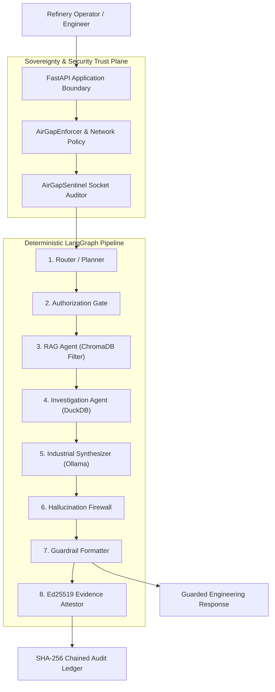

# MRPL AI Workbench — Sovereign On-Premises Industrial AI Platform

[](https://www.python.org/)
[]()
[]()
[]()

> **Sovereign Industrial AI Workbench Specification**  
> Tailored for **Mangalore Refinery and Petrochemicals Limited (MRPL)** on-premises operational technology (OT) environments.

---

## 1. Project Overview

The **MRPL AI Workbench** is a local-first, air-gap-capable operational intelligence platform. Designed specifically for high-security industrial facilities and petroleum refineries, it provides multi-agent reasoning, document inspection, code analysis, and multimodal P&ID visual analysis without transmitting data outside the host network boundary.

---

## 2. Problem Statement

Industrial facilities operate under strict security and compliance rules:
- Technical manuals, P&ID diagrams, sensor logs, and structural inspection notes contain confidential Intellectual Property (IP) and critical infrastructure data.
- Sending proprietary data to external cloud APIs poses severe data leak and operational risks.
- Standard LLM chat applications suffer from hallucinations and lack verifiable audit trails for engineering sign-offs.

---

## 3. Key Objectives

1. **100% Data Sovereignty**: All models, embeddings, vector stores, and telemetry run 100% on-premises.
2. **Least-Privilege Authorization**: User roles and document classifications constrain retrieval *before* vector search context reaches model memory.
3. **Evidence-Backed Verification**: Engineering responses undergo claim extraction, NLI evidence cross-checking, and causal guards to eliminate hallucinations.
4. **Independent Audit & Attestation**: Tamper-evident SHA-256 hash chaining and Ed25519 digital signatures (`.clora-proof`).

---

## 4. Architecture Overview



---

## 5. Local Model Stack

The workbench operates strictly on local open-weight models optimized for an off-grid workstation (RTX 5050 GPU, 16 GB System RAM):

| Role / Task Domain | Active Target Model Tag | Quantization / Spec | Manager Class |
| :--- | :--- | :--- | :--- |
| **General Reasoning & Docs** | `qwen2.5:7b-instruct` | Q4_K_M (7B parameters) | `QwenManager` |
| **Coding & Debugging** | `qwen2.5-coder:7b-instruct` | Q4_K_M (7B parameters) | `CoderManager` |
| **Vision & Diagram Analysis** | `qwen2.5-vl:3b-instruct` | 3B parameters | `VisionManager` |
| **Scanned Text/Table Extraction** | `paddleocr` | Primary Text/Table Engine | `PaddleOCR` / `TextOCR` |

---

## 6. Technology Stack

- **Core Runtime**: Python 3.10+ & FastAPI
- **Inference Engine**: Ollama Local Engine (`127.0.0.1:11434`)
- **Orchestration**: LangGraph Deterministic Workflow Engine
- **Vector Storage**: ChromaDB (Local Persistent Engine)
- **Embedding Engine**: Offline `SentenceTransformers` (`all-MiniLM-L6-v2`)
- **Analytics & Investigation**: DuckDB (Local In-Memory Analytical Engine)
- **Metadata Persistence**: SQLite (WAL Mode Enabled)
- **OCR Engine**: PaddleOCR (Primary Text/Table Extraction)
- **Security & Integrity**: Ed25519 Cryptography & SHA-256 Hash Chaining

---

## 7. 6-Tier Sovereign Local Storage

All local operational state is stored in the 6-tier sovereign data plane:

```text
data/
├── documents/          # Raw document uploads
├── workspaces/         # Workstation state & user files
├── chroma/             # Persistent ChromaDB vector database
├── sqlite/             # SQLite database (WAL mode)
├── duckdb/             # Analytical telemetry database
└── audit/              # SHA-256 chained audit logs
```

---

## 8. Three-Layer Defense-in-Depth Security Architecture

The **MRPL AI Workbench** protects sensitive industrial information throughout the complete AI data lifecycle:

$$\text{User} \longrightarrow \text{Authentication} \longrightarrow \text{Authorization} \longrightarrow \text{Secure Retrieval} \longrightarrow \text{AI Processing} \longrightarrow \text{Verification} \longrightarrow \text{DLP} \longrightarrow \text{Attestation} \longrightarrow \text{Audit}$$

The security architecture consists of three major defense-in-depth security layers designed for high-security operational technology (OT) environments, preventing unauthorized retrieval context leakage, prompt injection attacks, and undetected audit manipulation.

---

### 8.1 Complete Secure AI Pipeline

```text
                    ┌──────────────────────┐
                    │        USER          │
                    └──────────┬───────────┘
                               ↓
                    ┌──────────────────────┐
                    │   Authentication     │
                    └──────────┬───────────┘
                               ↓
                    ┌──────────────────────┐
                    │ Layer 1              │
                    │ RBAC / ABAC          │
                    │ Workspace Isolation  │
                    │ Classification       │
                    └──────────┬───────────┘
                               ↓
                    ┌──────────────────────┐
                    │ Pre-Retrieval        │
                    │ Authorization Filter │
                    └──────────┬───────────┘
                               ↓
                    ┌──────────────────────┐
                    │      ChromaDB        │
                    │ Authorized Retrieval │
                    └──────────┬───────────┘
                               ↓
                    ┌──────────────────────┐
                    │ Layer 2              │
                    │ Untrusted Content    │
                    │ Prompt Injection     │
                    │ Defense              │
                    └──────────┬───────────┘
                               ↓
                    ┌──────────────────────┐
                    │     Local LLM        │
                    │       Ollama         │
                    └──────────┬───────────┘
                               ↓
                    ┌──────────────────────┐
                    │ Evidence Verification│
                    │ Hallucination Firewall│
                    └──────────┬───────────┘
                               ↓
                    ┌──────────────────────┐
                    │ DLP Security Gate    │
                    │ ALLOW / REDACT/BLOCK │
                    └──────────┬───────────┘
                               ↓
                    ┌──────────────────────┐
                    │ Guardrail Formatter  │
                    └──────────┬───────────┘
                               ↓
                    ┌──────────────────────┐
                    │ Layer 3              │
                    │ SHA-256 Audit Chain  │
                    │ Ed25519 Attestation  │
                    └──────────┬───────────┘
                               ↓
                    ┌──────────────────────┐
                    │      RESPONSE        │
                    └──────────┬───────────┘
```

---

### 8.2 Security Context Propagation

Security state propagates through the processing pipeline using a trusted, server-side security context structure. Downstream components (retrievers, vector stores, multi-agent graphs, formatters) rely strictly on this validated context rather than independently parsing untrusted user parameters:

```text
SecurityContext
├── user_id                         # Authenticated user identity string
├── role                            # Validated RBAC UserRole enum
├── workspace_id                    # Isolated workspace/facility boundary
├── classification / clearance      # Dynamic numeric security clearance ceiling (1-5)
├── session_id                      # Unique conversation/task session identifier
└── authorization_state             # Compiled pre-retrieval policy & ChromaDB filter rules
```

---

### 8.3 Layer 1 — Access & Authorization Security

Layer 1 prevents unauthorized users from retrieving or viewing sensitive industrial information by enforcing identity verification and pre-retrieval authorization constraints.

* **Authentication (Server-Side Verified)**:
  Establishes a trusted user identity before granting access to protected platform resources ([`src/auth/authentication.py`](file:///c:/Users/shrav/OneDrive/Desktop/MRPL_AI_Workbench/src/auth/authentication.py), [`src/auth/service.py`](file:///c:/Users/shrav/OneDrive/Desktop/MRPL_AI_Workbench/src/auth/service.py)). The platform does not trust user identity, role, workspace, or clearance information supplied directly by the frontend client. Security decisions are evaluated against a trusted server-side security context.
* **Role-Based Access Control (RBAC)**:
  Enforces role permissions determining allowable platform operations ([`src/auth/models.py`](file:///c:/Users/shrav/OneDrive/Desktop/MRPL_AI_Workbench/src/auth/models.py), [`src/auth/roles.py`](file:///c:/Users/shrav/OneDrive/Desktop/MRPL_AI_Workbench/src/auth/roles.py)):
  * `ADMIN`: System administration, security configuration, and audit management.
  * `ENGINEER`: Technical engineering, P&ID visual analysis, and confidential technical document access.
  * `OPERATOR`: Operational refinery monitoring, telemetry inspection, and SOP querying.
  * `ANALYST`: Historical investigation, analytics read-access, and telemetry querying.
  * `VIEWER`: Read-only access restricted to public SOPs and baseline documentation.
* **ABAC / Policy-Based Authorization**:
  Centralized authorization decisions evaluated via `AuthorizationGate` ([`src/core/security/authorization_gate.py`](file:///c:/Users/shrav/OneDrive/Desktop/MRPL_AI_Workbench/src/core/security/authorization_gate.py)) combine user role, target workspace ID, document classification ceiling, resource ownership, and requested operation type into a unified filter.
* **Document Classification Model**:
  Hierarchical 5-level document classification model enforced during ingestion and pre-retrieval filtering:
  1. `PUBLIC` (Level 1): Public SOPs and baseline guidelines.
  2. `INTERNAL` (Level 2): Internal operational notes and telemetry logs.
  3. `OPERATIONAL` (Level 3): Refinery operational parameters and unit schematics.
  4. `CONFIDENTIAL` (Level 4): Proprietary engineering manuals and technical specifications.
  5. `RESTRICTED` (Level 5): Critical infrastructure data, strategic IP, and admin credentials.
* **Workspace Isolation**:
  Every sensitive document, chunk, analytical query, and task session remains strictly associated with its authorized `workspace_id`.
  > **Security Objective**: A user authorized for one workspace must **never** receive retrieval results, telemetry data, or session context belonging to another unauthorized workspace.
* **Pre-Retrieval Authorization (Vector Security Gate)**:
  Authorization is performed **BEFORE** vector retrieval execution so unauthorized document chunks never enter the AI context memory ([`src/retrieval/retriever.py`](file:///c:/Users/shrav/OneDrive/Desktop/MRPL_AI_Workbench/src/retrieval/retriever.py)).

  ```text
  User Request ──> Authentication ──> RBAC/ABAC Gate ──> Metadata Filter ──> ChromaDB Search ──> Authorized Context Only ──> LLM
  ```
* **Fail-Closed Security**:
  Security decisions fail closed by default. If identity is missing, role is invalid, workspace is unassigned, document classification is unknown, authorization policy cannot be evaluated, or security metadata is malformed, access is immediately denied (HTTP 401/403) or constrained to minimum baseline clearance (Level 1 / `VIEWER`). Unrestricted access fallbacks are strictly prohibited.

---

### 8.4 Layer 2 — Data & AI Security

Layer 2 protects sensitive information while it is being actively processed by local LLMs and multi-agent workflows.

* **Untrusted Document Boundary**:
  Uploaded documents, PDFs, OCR output, images, retrieved RAG chunks, and external text are treated as untrusted content ([`src/security/input_sanitizer.py`](file:///c:/Users/shrav/OneDrive/Desktop/MRPL_AI_Workbench/src/security/input_sanitizer.py)). Document content is wrapped in explicit isolation boundary markers (`<<<UNTRUSTED_DOC_DATA>>>`) before passing to model prompts.
  > **Critical Rule**: Document content must **never** override system security policy or system instructions.
* **Prompt Injection Defense**:
  The platform scans inputs and retrieved chunks for instruction injection patterns using regex detection (`InputSanitizer`). Prompt injection attempts are prevented from bypassing authorization, exposing restricted documents, revealing system prompts, revealing credentials, executing unauthorized tools, or overriding security policies.
* **Minimum Necessary Retrieval (Least Privilege)**:
  Retrieval follows the principle of least privilege using pre-retrieval filters, classification ceilings, restrictive top-$k$ limits (`top_k=3` default), similarity thresholds, and context-size limits to retrieve only the minimal information required to answer authorized user queries.
* **Data Loss Prevention (DLP — Output Security Gate)**:
  Outputs pass through verification and security formatting before user delivery:

  ```text
  LLM Response ──> Evidence Verification ──> DLP Scanner ──> Security Policy (ALLOW / REDACT / BLOCK) ──> Response Formatter ──> User
  ```
  * **Implemented**: Secret redaction in persistence and audit storage ([`src/persistence/repositories.py`](file:///c:/Users/shrav/OneDrive/Desktop/MRPL_AI_Workbench/src/persistence/repositories.py)) recursively strips internal credentials, passwords, and API keys.
  * **Planned / Recommended Production Hardening**: Full automated pattern scanning of generated model responses for arbitrary API keys, private keys, passwords, and custom sensitive identifiers prior to output formatting.
* **Bulk Data Extraction Protection**:
  Rate limiting ([`src/security/rate_limiter.py`](file:///c:/Users/shrav/OneDrive/Desktop/MRPL_AI_Workbench/src/security/rate_limiter.py)), query budgets, retrieval limits, and context limits prevent automated bulk data exfiltration through the AI interface.
* **Session & Memory Isolation**:
  Conversation state, task execution context, and retrieved evidence remain strictly isolated by `user_id`, `workspace_id`, and `session_id` (`idx_tasks_session` index in SQLite). Context leakage across users or sessions is prevented.
* **Tool Security**:
  Agent tool usage is strictly governed by `AgentPolicy` ([`src/agents/policies.py`](file:///c:/Users/shrav/OneDrive/Desktop/MRPL_AI_Workbench/src/agents/policies.py)):
  * **Allowlisted Tools**: Explicitly permits `rag_tool`, `document_tool`, `vision_tool`, `coding_tool`, `chat_tool`.
  * **Prohibited Tools**: Hard-blocks `shell_tool`, `bash_tool`, `python_eval_tool`, `subprocess_tool`, `network_tool`, `browser_tool`, `external_api_tool`.
  * Server-side parameter validation ensures arbitrary shell or host execution is unavailable to the model, credentials are never exposed to LLMs, and tool output is treated as untrusted data.
* **Encryption at Rest**:
  * **Planned / Recommended Production Hardening**: Authenticated encryption at rest (e.g. AES-256-GCM) for local ChromaDB vector databases, SQLite databases, and document stores. Production deployments should manage encryption keys via OS Keyring, Enterprise KMS, or HSM modules rather than hardcoded keys.

---

### 8.5 Layer 3 — Integrity, Attestation & Audit Security

Layer 3 provides tamper-evident evidence, verification, and accountability across the AI lifecycle.

* **Cryptographic SHA-256 Audit Chain**:
  Security events append to a local JSONL ledger using SHA-256 cryptographic hash chaining ([`src/audit/hash_ledger.py`](file:///c:/Users/shrav/OneDrive/Desktop/MRPL_AI_Workbench/src/audit/hash_ledger.py)):

  $$\text{Event}_1 \xrightarrow{\text{SHA-256}} \text{Event}_2 \xrightarrow{\text{SHA-256}} \text{Event}_3 \xrightarrow{\text{SHA-256}} \dots$$

  Each audit event embeds the SHA-256 hash of the preceding event (`previous_hash`). Any unauthorized modification, deletion, insertion, or reordering breaks the chain and is detected during integrity auditing (`verify_integrity()`).
* **Ed25519 Digital Evidence Attestation**:
  Engineering proof packages are cryptographically signed using Ed25519 digital signatures ([`src/attestation/evidence_attestor.py`](file:///c:/Users/shrav/OneDrive/Desktop/MRPL_AI_Workbench/src/attestation/evidence_attestor.py)), exporting `.clora-proof` artifacts containing `request_id`, UTC timestamp, SHA-256 canonical fingerprint, citations list, public key ID (`key_id`), and base64 signature.
  > **Note**: Cryptographic attestation proves the **integrity and authenticity** of the signed artifact; it does not guarantee the factual correctness of underlying AI reasoning.
* **Security Event Auditing**:
  Security-relevant actions generate structured audit events ([`src/security/security_service.py`](file:///c:/Users/shrav/OneDrive/Desktop/MRPL_AI_Workbench/src/security/security_service.py), `AuditLedger.append_event`), covering authentication, authorization decisions, document ingestion, classification, retrieval decisions, denied retrievals, prompt-injection detection, rate limiting/DLP events, blocked responses, tool execution, model execution, attestation generation, and proof verification failures.
  > **Sanitization Rule**: Audit records sanitize and redact raw confidential documents, passwords, credentials, or API keys (`redact_sensitive_data`).

---

### 8.6 Security Invariants

The platform operates under ten strict security invariants:

1. **Pre-Retrieval Enforceability**: Unauthorized data must **never** enter the LLM context.
2. **Prior Authorization**: Authorization must happen **before** sensitive vector retrieval.
3. **Policy Supremacy**: Document content cannot override system security policy.
4. **Credential Isolation**: LLMs must **never** receive encryption keys, signing keys, passwords, or credentials.
5. **Output Gating**: Sensitive model output must pass through the DLP security gate.
6. **Strict Boundary Isolation**: Cross-workspace and cross-session data access must be prevented.
7. **Complete Auditability**: Security decisions must be auditable.
8. **Tamper Detection**: Audit tampering (modification, deletion, reordering) must be cryptographically detectable.
9. **Fail-Closed Default**: Security failures must fail closed.
10. **Integrity vs. Truth Boundary**: Cryptographic attestation proves artifact integrity and authenticity, not factual correctness.

---

## 9. RAG Architecture

Documents (PDF, DOCX, CSV, images) are parsed locally (via PaddleOCR for scanned media), chunked, tagged with security metadata, embedded via `SentenceTransformers`, and indexed into ChromaDB. Similarity searches enforce strict pre-retrieval role and classification filters.

---

## 10. Multi-Agent Topology

The workflow runs as a **deterministic LangGraph pipeline**. Requests pass sequentially through planning, authorization, RAG retrieval, DuckDB investigation, industrial synthesis, hallucination verification, 5-section formatting, and Ed25519 evidence attestation.

---

## 11. Evidence Verification (Hallucination Firewall)

Responses are audited before release:
- **Claim Extractor**: Parses statements from the draft response.
- **NLI Verifier**: Cross-checks claims against retrieved evidence (`SUPPORTED`, `PARTIALLY_SUPPORTED`, `INSUFFICIENT_EVIDENCE`, `CONTRADICTED`).
- **Causal Leap Guard**: Restricts correlation from being reported as causation.
- **Guardrail Formatter**: Outputs a structured 5-section response (Findings, Analysis, Uncertainty, Confidence, Evidence).

---

## 12. Air-Gap & Sovereignty Enforcement

The application enforces `STRICT_AIRGAP` mode, blocking non-loopback outbound socket connections and auditing network attempts via `AirGapSentinel`.

---

## 13. Hardware Requirements

- **RAM**: 16 GB System Memory
- **GPU**: NVIDIA RTX 5050 (~8 GB VRAM)
- **Strategy**: Single-model lazy loading with sequential VRAM eviction (`load -> execute -> unload`).

---

## 14. Installation & Quickstart

```powershell
# 1. Clone repository
git clone https://github.com/mrpl/mrpl-ai-workbench.git
cd MRPL_AI_Workbench

# 2. Install dependencies
py -3 -m pip install -r requirements.txt

# 3. Initialize sovereign directories & SQLite WAL mode
py -3 scripts/setup.py

# 4. Verify environment
py -3 scripts/verify_environment.py
```

---

## 15. Running the Application

```powershell
# Start local FastAPI application server
py -3 -m uvicorn src.api.app:app --reload
```

Access API endpoints at `http://127.0.0.1:8000/docs`.

---

## 16. Primary API Endpoints

- `GET /health` — Application and router health status.
- `GET /models` — Available local model status and VRAM metrics.
- `POST /router` — Intent classification and workflow routing.
- `POST /chat` — Standard Q&A endpoint.
- `POST /workbench/chat` — Unified grounded Q&A workflow.
- `POST /workbench/documents` — Sovereign document ingestion & indexing.
- `POST /workbench/images` — Vision inspection workflow.

---

## 17. Project Structure

```text
MRPL_AI_Workbench/
├── README.md                      # GitHub Project Overview
├── ARCHITECTURE.md                # Master System Architecture
├── requirements.txt               # Sovereign Base Dependencies
├── config/                        # Settings & Configuration
├── docs/                          # Technical Documentation
├── data/                          # 6-Tier Sovereign Local Storage
├── src/                           # Application Source Code
│   ├── api/                       # FastAPI Endpoints & Middleware
│   ├── core/                      # Security & Network Isolation Policies
│   ├── models/                    # Ollama Model Managers (Qwen, Coder, Vision)
│   ├── routing/                   # Intelligent Model Router & Intent Classifier
│   ├── ocr/                       # PaddleOCR Engine & Fallback Pipeline
│   ├── document_processing/       # PDF/DOCX/CSV Parsers & Chunkers
│   ├── embeddings/                # SentenceTransformers Local Embedding Engine
│   ├── retrieval/                 # Pre-Retrieval Authorization Filter
│   ├── rag/                       # Local ChromaDB Vector Store
│   ├── orchestration/             # LangGraph Deterministic Pipeline
│   ├── analytics/                 # DuckDB Local Investigation Engine
│   ├── verification/              # Hallucination Firewall & Formatter
│   ├── audit/                     # SHA-256 Chained Audit Ledger
│   └── attestation/               # Ed25519 Evidence Attestor
├── tests/                         # Pytest Suite (251 unit/integration tests passing 100%)
└── scripts/                       # Verification & Setup Scripts
```

---

## 18. Testing & Security Verification

Run the full offline test suite:

```powershell
py -3 -m pytest
```

### Security Test Suite Breakdown (251 Unit & Integration Tests Passing 100%)

* **Access & Authorization Security**:
  * Identity authentication, bearer token validation, missing identity, expired tokens (`test_auth_api.py`, `test_rbac_service.py`).
  * Role permissions (`ADMIN`, `ENGINEER`, `OPERATOR`, `ANALYST`, `VIEWER`), invalid roles, privilege escalation prevention.
  * Pre-retrieval vector filtering, workspace isolation, restricted document clearance limits (`test_authorized_retriever.py`).
  * Unauthorized API access rejection (HTTP 401/403).
* **Data & AI Security**:
  * Malicious prompt injection pattern detection (`test_input_sanitizer.py`).
  * Untrusted document boundaries (`<<<UNTRUSTED_DOC_DATA>>>`) for PDF, OCR, and text chunks.
  * Rate limiting, query budgets, and bulk data extraction protection (`test_rate_limiter.py`).
  * Prohibited tool blocking (shell/bash execution) and parameter validation (`test_agent_governance.py`).
  * Session isolation and memory boundary partitioning (`test_persistence_api.py`).
* **Integrity & Attestation Security**:
  * SHA-256 audit ledger hash chain validation, modified event, deleted event, and reordered event detection (`test_hash_ledger.py`).
  * Ed25519 signature generation, public-key verification, and corrupted `.clora-proof` detection (`test_evidence_attestor.py`).
  * Hallucination firewall, claim extraction, NLI evidence verifier, and causal guard sanitization (`test_hallucination_firewall.py`, `test_nli_verifier.py`).

---

## 19. Production Security & Deployment Disclaimer

The **MRPL AI Workbench** implements defense-in-depth controls designed to reduce unauthorized access, data leakage, prompt injection risk, unsupported AI claims, and undetected evidence tampering.

### Implementation Status & Production Hardening Guidance

* **Implemented Controls**: Server-side authentication, RBAC/ABAC authorization, pre-retrieval vector filtering, workspace isolation, document classification ceilings, prompt injection detection, untrusted document wrapping, prohibited tool blocking, rate limiting, SHA-256 audit chaining, and Ed25519 evidence attestation.
* **Recommended Production Hardening**:
  * **Network Isolation**: Application-level socket enforcement (`AirGapSentinel`) should be paired with OS-level firewall rules (`iptables` / Windows Defender Firewall), network segmentation, and physical network air-gapping in production OT deployments.
  * **Output DLP Scanner**: Deployment of dedicated pattern-based DLP scanner pipelines for generated outputs in enterprise production environments.
  * **Encryption at Rest**: AES-256-GCM authenticated encryption at rest for local ChromaDB vector databases and SQLite metadata stores, integrated with OS Keyring, KMS, or HSM modules.
  * **Operational Hardening**: Infrastructure hardening, secure key management, and periodic offline audit ledger verification.

---

## 20. License

Proprietary / Confidential — Developed for **MRPL**. All rights reserved.
