# MRPL AI Workbench — Multi-Agent & Orchestration Architecture

## Deterministic Agent Graph

The multi-agent architecture is a **controlled, deterministic state pipeline** managed via LangGraph, rather than an unconstrained multi-agent chat room.

---

## Agent Pipeline Topology

```mermaid
flowchart LR
    Start([User Request]) --> Router["1. Planner / Router"]
    Router --> AuthGate["2. Authorization Gate"]
    AuthGate --> RAG["3. RAG Retrieval Agent"]
    RAG --> Investigate["4. Investigation Agent"]
    Investigate --> Synthesize["5. Industrial Synthesizer"]
    Synthesize --> Verify["6. Hallucination Firewall"]
    Verify --> Format["7. Guardrail Formatter"]
    Format --> Attest["8. Ed25519 Evidence Attestor"]
    Attest --> End([API Response])
```



---

## Agent Contracts

| Stage | Responsibility | Primary Model / Engine | Primary Output | Hard Safeguard |
|---|---|---|---|---|
| Router | Classify intent & select model | `qwen2.5:7b-instruct` | Route plan & model assignment | No direct document retrieval |
| Authorization Gate | Build allowed retrieval policy | Security Gate Engine | Permission filter query | Scope narrowing or HTTP 403 deny |
| RAG Agent | Query local ChromaDB vector store | `all-MiniLM-L6-v2` / `ChromaDB` | Ranked evidence chunks | Filter applied **before** retrieval |
| Investigation Agent | Query DuckDB telemetry store | `DuckDB Engine` | Correlations & aggregations | Reject unsafe SQL; no network access |
| Industrial Synthesizer | Draft engineering response | `QwenManager` / `CoderManager` / `VisionManager` | Cited draft text | Every claim must have source citation |
| Hallucination Firewall | Cross-verify claims against evidence | NLI Engine / Verification Firewall | NLI Verdicts & confidence score | Contradicted claims cause rejection |
| Guardrail Formatter | Render 5-section response | Guardrail Formatter | Formatted report | Forces explicit disclosure of uncertainty |
| Evidence Attestor | Generate digital proof package | `EvidenceAttestor` (Ed25519) | `.clora-proof` package & signature | Private key strictly local |

---

## Typed Workflow State

The pipeline state is maintained as a strongly-typed dictionary across graph transitions:

```python
class WorkbenchWorkflowState(TypedDict):
    request_id: str
    user_id: str
    role: str
    workspace_id: str
    network_profile: str
    intent: str
    workflow_route: str
    authorization_scope: Dict[str, Any]
    retrieved_chunk_ids: List[str]
    citations: List[Dict[str, Any]]
    approved_queries: List[str]
    analysis_results: Dict[str, Any]
    draft_claims: List[Dict[str, Any]]
    verification_results: List[Dict[str, Any]]
    uncertainty_items: List[str]
    final_response: str
    audit_event_ids: List[str]
    attestation_id: Optional[str]
    status: str
```
