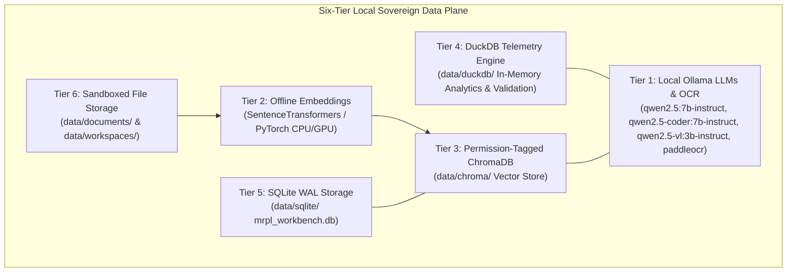
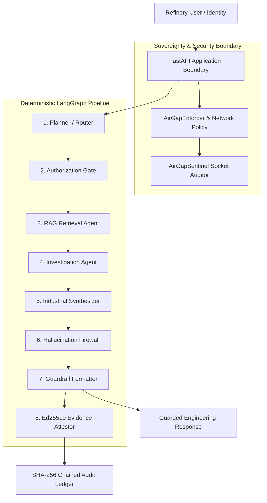

# MRPL AI Workbench — Architecture Specification

## Executive Overview

The **MRPL Sovereign On-Premises AI Workbench** is a local-first, air-gap-capable operational intelligence platform engineered for refinery and industrial technology (OT) environments. 

The system operates strictly within local workstation boundaries under three architectural mandates:
1. **Data Sovereignty** — Zero external API calls, cloud telemetry, or remote vector storage.
2. **Least-Privilege Retrieval** — RBAC roles (`ADMIN`, `ENGINEER`, `OPERATOR`, `ANALYST`, `VIEWER`) and document classification filters are enforced *before* vector search context reaches model memory.
3. **Defensible Outputs** — Engineering answers undergo multi-tier evidence verification, SHA-256 tamper-evident hash chaining, and Ed25519 cryptographic signing.

---

## 6-Tier Sovereign Processing Plane

---

## High-Level Execution Topology

---

## Component Responsibilities

| Layer | Component | Core Function |
|---|---|---|
| API & Auth | `src/api/` | FastAPI REST endpoints, Bearer auth, RBAC context propagation |
| Sovereignty | `src/core/network/` | Enforces `STRICT_AIRGAP` policy and socket audit logging |
| Security Gate | `src/core/security/` | Path traversal protection, input sanitization, classification filters |
| Model Managers | `src/models/` | `QwenManager`, `CoderManager`, `VisionManager` Ollama execution |
| OCR Subsystem | `src/ocr/` | `PaddleOCR` primary text/table extraction with `VisionAnalyzer` fallback |
| Routing | `src/routing/` | `ModelRouter` and `IntentClassifier` for model selection |
| RAG & Vector | `src/rag/`, `src/retrieval/` | Permission-filtered similarity search in ChromaDB |
| Analytics | `src/analytics/` | DuckDB analytical queries with SQL safety validator |
| Verification | `src/verification/` | Claim extraction, NLI cross-checking, causal leap guard |
| Audit & Proof | `src/audit/`, `src/attestation/` | Hash-chained JSONL logging & Ed25519 digital signature export |
